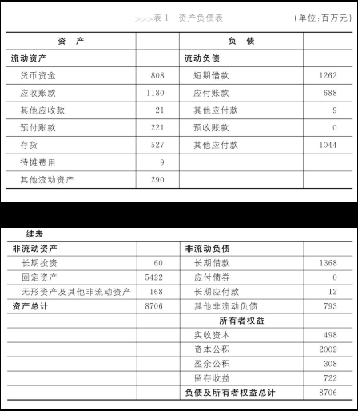

# 自序

> 学习财务知识 ，需要带着看企业的目的 ，而不能陷入会计数字 ，将数字与它所描述的企业割裂开来 。一旦你把财务数据当作向你讲述企业运营状况的语言 ，你将发现财务数据不仅妙趣横生 ，而且浅显易懂 。

这本书的确达到了这个目标。

# 引言 会计是什么

企业管理层、咨询公司、投资银行、证券公司都会看会计做的财务报表来作决策、定价等。会计帮助分析财务信息作出决策。

# 资产负债表——企业的单反相机

## 会计眼中的企业活动

财务报表是用来描述企业的经济活动。企业的经济活动包括经营、投资和融资。会计眼里只有这三件事。

## 资产负债表

企业所有的经济活动都可以概括为从现金出发，经过经营、投资、融资等过程回到现金的过程。企业的根本目的就是赚钱，其基本要求是不能使股东投入的本金受到损失。用于描述股东本金价值的就是资产负债表。

组成

- 资产[^排序]
    - 流动资产(Current Assets)
        - 货币资金(Cash)
            - 库存现金、银行存款、其他货币资金
        - 应收账款(Accounts Receivable)
        - 其他应收款(Other Receivable)
            - 比如给其他公司的无利息借款
        - 预付账款(Prepaid Accounts)
        - 在产品(Work in Process)
            - 有广狭二义
        - 产成品(Finished Goods)
        - 存货(Inventory)
        - 待摊费用[^待摊费用]
            - 比如买了6万元的打印纸
    - 非流动资产(Non-current Assets)[^与流动资产的差异]
        - 长期投资(Long-term Investments)
            - 不准备在一个经营周期内转变为现金的投资
        - 固定资产(Fixed Assets)
            - 为经营而持有；使用寿命超过一个会计年度
            - 折旧(Depreciation)
        - 无形资产(Intangible Assets and Other Assets)
            - 比如专利；在中国，土地使用权也是无形资产
- 负债(Liability)
    - 流动负债(Current Liabilities)
        - 短期借款(Short-term Borrowing)
        - 应付账款(Accounts Payable)
        - 其他应付款(Other Payables)
        - 预收账款(Deposit Received)
        - 其他应付款，比如应交税金、应付工资
    - 非流动负债(Non-current Liabilities)
        - 长期借款(Long-term Loans Payable)
        - 应付债券(Bond Payable)
        - 长期应付款(Long-term Payable)，比如租赁
- 股东权益(Shareholder's Equity)，也称净资产，反映了公司的自有资本
    - 股本(Capital Stock)
        - 在中国股本必须等于注册资本
    - 资本公积(Additional Paid-in Capital)
        - 即股东实际投入资金多于注册资本的部分
        - 对于上市公司，股票的面值是股本，售价减去面值的部分是资本公积。
        - 当公司有多个股东的时候，不是以他们的投资额来确定股权比例，而是以他们在股本中所占的比例确定股权比例。
    - 盈余公积(Surplus Reserves)
        - 中国公司法规定，公司盈利必须留存至少10%作为盈余公积
    - 未分配利润(Retained Earnings)

[^排序]: 按照转换为现金的顺序排序
[^待摊费用]: 同是花钱，资产是花了这笔钱可以换来未来的价值，而费用则是花完就花完了。
[^与流动资产的差异]: 关键差异在于是否能够在一个循环内将自己变为现金。
- 负债和股东权益

## 对资产的解读

- 固定资产多可能是制造业企业
- 允许客户暂缓支付货款说明可能面临较强的行业竞争
- 人一般都不是公司的资产；但比如俱乐部中，球员的雇佣金算在“长期待摊费用”中，人变成了一个资产项目；还有，养鸡场的母鸡算作“生产性生物资产”，而公鸡算作存货。
- 除金融行业外，报表格式是一致的。

## 资产如何计价？

虽然资产现在在市场上的售价更能真实地体现资产的价值，但是由于难以找到客观标准衡量，所以会计谨慎地采用了历史成本/原始成本/实际成本(Historical Cost)：资产在其取得时为它所支付的现金或现金等价物的金额。如果资产升值了，则无视，而减值了，则计入资产价值中。

金融资产和投资性房地产有客观价格，所以采用当前市场价格计算。公允价值/公允市价/公允价格(Fair Value)

历史成本的含义：1) 只有花了的钱才能记在账上；2) 只有发生新的交易，资产才能增值。

## 一些概念区分

资产中的应收账款不是财产物资；财产物资中的租用的办公楼、代销的产品都不是资产。

今天的资产就是明天的费用，时间概念上区分。

## 对资产负债表的解读

资产表述了钱用在了什么地方；负债和股东权益表述了企业的钱从哪里来的。资产负债表说明了公司的财务状况，是一个时间点的概念。

会计恒等式：资产等于负债加股东权益。变形“负债=资产-股东权益”不正确，因为不能先分配股东权益。“股东权益=资产-负债”成立。“剩余求偿权”：股东才是公司风险和收益的最终承担者。
