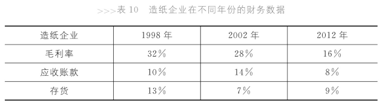
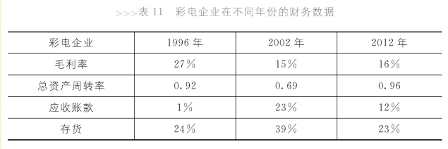

# 找出影响财务数据的因素

影响财务数据的因素

- 行业大环境
- 企业战略定位
- 战略执行能力

## 行业大环境

五力图(Five Forces Model)，五力分别是

- 供应商议价能力
    - 供货方数量
    - 供求关系
- 购买者议价能力
    - 购买方数量
    - 行业竞争环境是否激烈，即供求关系
- 潜在竞争者进入能力
- 行业内竞争者当前竞争能力
- 替代品替代能力

前两者是企业面临的产业链环境，后三者是行业内部竞争状态。

## 行业差异：造纸与家电

### 两个行业基本特征

造纸行业重资产，一万吨产能需要一亿投资。中国造纸行业的近些年趋势是90年代到08年投资大量涌入，加剧行业竞争；08年后产能过剩。而且，中国劳动力价格低廉，但原材料严重依赖进口，价格昂贵。

家电行业长时间竞争惨烈，利润微薄，而且销售渠道掌握在两三家公司手中，议价能力弱。

### 静态分析两个行业

02年的财务数据对比如下

- 造纸毛利率28%；家电只有15%
- 造纸应收货款14%，存货7%；家电应收货款23%，存货39%
- 造纸应付账款8%；家电15%。原因是造纸业原材料价格昂贵，上游供货商议价能力强。
- 造纸固定资产62%；家电14%
- 造纸总资产周转率0.51；家电0.69。家电作为流动资产为主的企业，总资产周转率居然和造纸（固定资产为主）接近，说明家电周转慢。

### 动态分析两个行业

上图显示了造纸行业的三个时间节点：98年、02年、12年。

98年到02年，行业竞争加剧，毛利率降低，但竞争还不是特别激烈，所以毛利率仍然较高。竞争加剧，毛利下降，造纸存货应该增加。但是，企业采取赊销使得存货减少为7%，同时应收账款增加至14%。赊销使得仓储成本下降，同时加快了资金周转率。但是存在应收账款是否能够收回的风险。

02年到12年，出现产能过剩，造纸的毛利下降到15%，但是应收账款下降为8%，存货略有增加。原因是，行业竞争白热化，赊销成为常态。该企业放弃赊销，采取降价促销，导致了毛利急剧下降，存货只是略有增加，应收账款下降。

上图显示了家电行业的三个时间节点：96年、02年、12年。

96年到02年，家电毛利率从27%下降到15%，竞争白热化导致大幅降价。此时企业有两个选择，一是向管理要效益，一是要效率。因为效率乘以效益就是投资回报，而效益可以分成向市场要效益和向管理要效益。由于竞争惨烈，管理效益也无法提升。上图显示家电的总资产周转率仍然下降了，这是因为行业大环境，企业回天乏术。行业竞争加剧导致应收货款、存货增加，周转率下降，即竞争导致供大于求、赊销（即使赊销，应收账款和存货也同时增加）、生产设备过剩（即固定资产周转率下降）。

02年到12年，家电毛利率基本不变，家电行业基本处于稳定。该企业资金周转率升高，应收账款、存货比重下降，似乎该企业经营状况得到改善。但其实是因为该公司的代理企业破产，其应收账款计入坏账；而且该企业将其应收账款和存货打包卖给一个关联企业。这不是正常的改善措施。

## 企业战略定位及执行力

战略定位

- 成本领先战略(Overall Cost Leadership)
    - 薄利多销
    - 薄利指的是毛利率低
    - 多销指的是营运能力，即周转率高
- 差异化战略(Differentiation/Differentiation Strategy)
    - 高毛利低周转率

企业可以设立自己的战略定位，但是不一定可以实现。实现需要战略执行能力。
