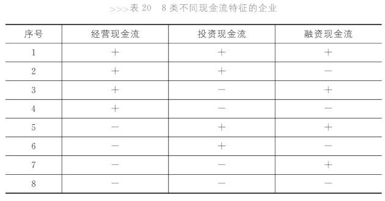

# 把控风险的要诀

## 健康企业的现金流特征

分析第2类企业：经营现金流为正，说明经营可以造血；投资现金流为正，说明企业可能有处置资产获得的现金或者获得了投资收益（经营活动很好，那么处置资产获得资金的可能性比较小）。融资现金流为负，说明企业在还利息或者给股东分红。这类企业是一个处于成熟阶段企业最常见的现金流状况。

企业的生命周期(The Life Cycle of Enterprise)：一般包括初创、成长、成熟和衰退阶段。

第1类企业的融资现金流也为正，说明（这是一家经营和投资状况良好的公司）正在融资，可能想要投资或者在为投资做准备。如果该企业正在投资，则其投资现金流会为负值。另外，该企业也可能没有投资计划，只是为了保证充足的现金。在中国，民营企业融资渠道受限。同时，也存在不良动机的融资行为，以实现掏空企业的目的。总之，如果没有投资计划而大规模融资，企业的盈利能力会被稀释。

如果第1类企业存在大规模投资，那么就会变成第3类企业，投资现金流为负。第3类企业经营上可以自给自足，并融入现金，总额用来投资。投资存在风险，即使投资方向正确，也不能保证企业无风险。中国某方便面企业在经营状况良好的情况下投资规模过大过快导致资金链断裂，最终破产。

第4类企业投资和融资现金流均为负。融资现金流正负均有风险。对于第4类企业，应该关注其净现金流。如果净现金流为负，则需要注意企业是否有充足的准备防止资金链断裂。如果净现金流为正，也不能保证没有风险。例如房地产公司在08年之前形势大好，经营现金流为正，投资和融资为负。但08年经济危机导致楼市下跌，经营现金流为负。房地产企业由第4类转为第8类企业，三类现金流均为负。此时企业要扭转局势。要是转为第6类，即投资现金流为正，则多半需要变卖资产，这是万不得已才会做的决定。要是转为第4类，则可以打折卖房，只为收回现金。企业还可以转为第7类，即融资现金流为正。08年前后，中国政府给房地产公司设置了严格的融资障碍，导致企业只能借到高利率贷款。

经营现金流为负的情况时常出现在企业初创或者衰退时期。对于初创企业，更有可能处于第7类，即大量融资支撑经营和投资。衰退企业多处在第5类和第6类。第5类可能在变卖资产或金融性资产获得投资收益，而第6类可能在变卖资产并且还利息。衰退企业也可能处于第7类状况，企业在投资新业务、寻找新的增长点。但此时企业处于衰退阶段，融资困难。

## 三张报表之间的关联

我们既知道如何用资产负债表和利润表来判断企业的运营状况，也知道如何用现金流量表了解企业的风险状况，那么当这两个体系出现矛盾的时候，我们该如何作出判断？我没看出来后面的例子跟这种矛盾有什么关系。后面的例子讲的是净利润和现金净流量之间的差额用于等于除现金之外其他资产和负债的变化。再后面的例子说明了什么叫赚钱但是没有钱的公司，即经营、投资现金流为负，融资现金流为正，净利润为正。由于净利润和现金净流量之间的差额用于等于除现金之外其他资产和负债的变化，所以根据这个例子中的公司存货和应收账款急剧增加导致其净利润因为卖出了产品而增加但现金净流量却没有增加。这个例子中的公司是电子书公司，刚开始市场热度高，但后来电子书市场受到智能手机的挤压。这个例子中现金流量表更好地反映公司真实状况。另一家公司净利润为正但现金流量同样为负。这家公司从事通信设备制造，专业定制，生产产品有订单支持。而且客户是大型电信公司，坏账可能性小，应收账款虽然时间长，但是一定会收回。这样，利润表就会比较准确反映公司真实资金状况。

利润表和现金流量表的关注点不同，前者关注收益，后者关注风险。

# 终曲

略
