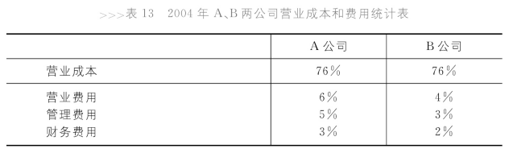
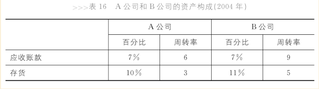
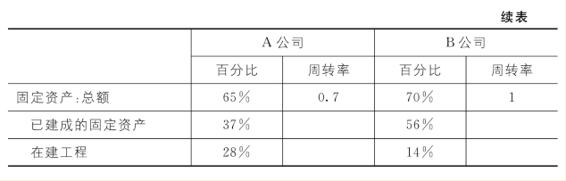

# 给自己的公司照镜子

## 造纸业A公司的经历

1. 技术领先，站稳脚跟
2. 扩大生产规模，成为行业中产能最大的公司
    - 自身投资
    - 并购
3. 开拓国际市场
4. 拓宽原材料来源
    - 中国造纸业原材料紧张
    - A公司建设多个原材料基地

但A公司的财务数据并不乐观。对比B公司，从净利润的角度来讲，A公司的净利润水平是7%，而竞争对手B公司是10%；从效率方面讲，A公司的总资产周转率是0.45%，而竞争对手B公司是0.7%；再看看总资产报酬率，A公司的总资产报酬率只有3%，而B公司则达到了7%。

## 成本费用问题

A公司产能150万吨，B公司50万吨，但A公司并没有因为规模大而降低成本。这是因为造纸业中，每种产品的生产设备相互独立，必须单一生产线规模够大才能降低成本。而A公司生产品种多，并没有在单一生产线上发挥规模效应。这是固定成本的角度。而在原材料上，虽然A公司建设了自己的原材料基地，但是种树需要时间才能收获原材料，所以A公司暂时没有发挥出原材料优势。而B公司因为主要生产新闻纸，不需要木浆，所以采用工厂所在地丰富的苇草资源作为原料，降低了成本。

财务费用上，A公司支出高于B公司。A公司的大手笔发展导致其债务融资(Debt Financing)高，有息负债占总资产44%，B公司只有19%。营业费用（销售和运输）上，A公司积极开拓市场，各地销售费用较高，并且实施产供销一体化策略（暂时没有发挥效益），原料产地与销售部分分开，运费也较高。另外，管理费用上，A公司的大量并购导致其整合过程中管理效率下降，费用升高。

## 周转率

A公司的总资产周转率0.45%，B公司0.7%。

两家公司总资产中占比较大的三项分别是固定资产、存货、应收账款。

- A公司固定资产中在建工程占比较大，0周转率。
- A公司囤积存货，影响周转率
- A公司应收账款更多，但再查看其应收账款帐龄可知大多账款均可再一年内收回。

## A公司的后续发展

08年后，造纸业的大环境竞争加剧，新闻纸部分市场份额被电子化阅读代替。这就造成B公司的主营业务受损。而A公司产品线丰富，影响较小。A公司逐年的利润上升。这显示出A公司的市场远见。
