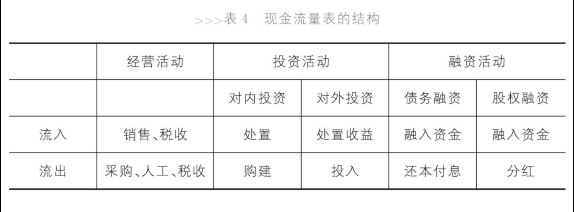

# 解剖现金流量表

现金流量表(Cash Flow Statement)：从经营、投资、融资三个角度描述现金的流入和流出

- 经营
    - 销售：流入
    - 采购：流出
    - 支付工资：流出
    - 缴税：流出，有时也可以流入现金[^税收流入现金]
- 投资
    - 对内投资、对外投资：流出
    - 变卖资产、投资收益：流入
- 融资
    - 债务融资、股权融资：流入+流出（比如利息、分红）
    - 融资性租赁：其实是一种分期付款的购买行为

[^税收流入现金]: 比如代收的增值税，还有退税(Tax Rebate)。

## 现金流量表的意义

现金流入与流出之差是现金净流量，描述了企业的资金变化情况。虽然资产负债表的年初与年末对比一样可以得到资金状况，但是专门分类描述经营、投资、融资活动的现金流量可以明确的描述企业的资金状况。[^现金流量的例子] 而且，现金是企业最重要的部分，关系生死存亡。

[^现金流量的例子]: A公司经营活动现金流量为1亿元，投资和融资分别花费8000万元和1000万元；B公司经营活动现金流量为-5000万元，投资活动花费2000万元，但融资活动获得8000万元。两个公司的现金流量均为1000万元，但资金状况截然不同，A公司运行健康，B公司入不敷出。

## 上一章公司的现金流量表

1. 设立公司
    - 融资流入3200万元
2. 向银行借款
    - 融资流入5100万元
3. 购置厂房、设备等
    - 投资流出5700万元
4. 购买土地使用权
    - 投资流出150万元
5. 采购原材料
    - 经营流出1600万元
6. 生产
    - 经营流出1200万元
7. 销售
    - 经营流入3000万元
8. 采购
    - 经营流出150万元
9. 研究技术
    - 经营流出50万元
10. 工资
    - 经营流出400万元
11. 利息
    - 融资流出130万元
12. 纳税
    - 经营流出100万元
13. 分红
    - 融资流出100万元

汇总得到三项活动的现金流量

- 经营：-500万元
    - 现金流量为正不等同于盈利，该公司净利润520万元。经营活动现金流量为负意味着公司销售获得的资金不足以支付日常开支和缴税，需要借助融资活动和投资活动供血。
- 投资：-5850万元
- 融资：8070万元

该公司现金净流量为1720万元，等于资产负债表中的货币资金1720万元。所以根据现金流量表描述公司的经济活动：融资8070万元，投资5850万元，补了经营活动500万元的资金缺口，最后剩下1720万元的资金。

## 分类

- 经营活动现金流量(Cash from Operating Activities)
    - 流出：1）销售产品、提供劳务；2）收到的税费；3）其他与经营活动有关的现金
    - 流入：1）购买商品、接受劳务；2）支付工资；3）支付税费；4）其他与经营活动有关的现金
- 投资活动现金流量(Cash form Investing Activities)
    - 1）投资支出/收益的现金；2）处置（购买或出售）固定资产、无形资产和其他长期资产而收到的现金净额；3）其他与投资活动有关的现金
- 融资活动现金流量(Cash form Financing Activities)
    - 1）吸收投资的现金；2）借款收到的现金，偿还债务支付的现金；3）分红支付的现金；4）其他与融资活动有关的现金